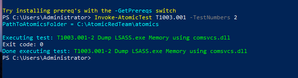
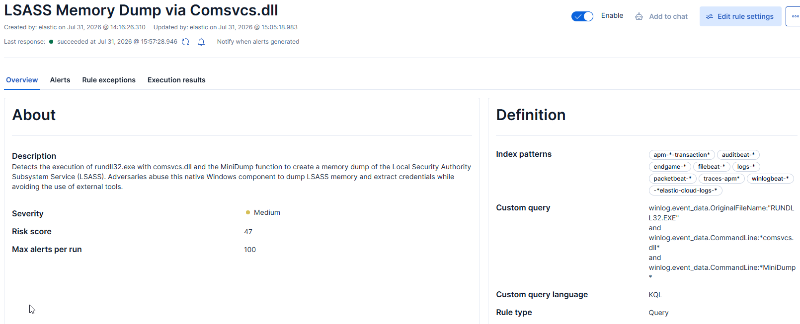
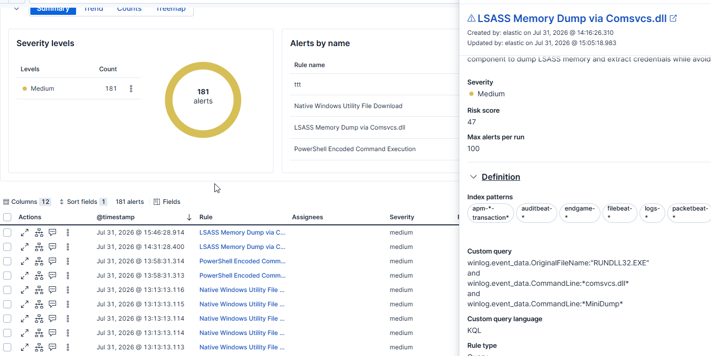

# T1003.001 – LSASS Memory Dump via Comsvcs.dll

## Overview

This project demonstrates the detection of **LSASS memory dumping** using the native Windows component **comsvcs.dll** executed through **rundll32.exe**.

Instead of relying on third-party tools such as Mimikatz or ProcDump, this technique abuses legitimate Windows functionality to create a memory dump of the Local Security Authority Subsystem Service (LSASS). Because only trusted Windows binaries are used, this behavior can blend into normal operating system activity and may bypass detections focused solely on known offensive tools.

This detection focuses on identifying the characteristic command-line arguments required to invoke the **MiniDump** function within **comsvcs.dll**.

**MITRE ATT&CK**

- Technique: **T1003.001 – LSASS Memory**
- Tactic: **Credential Access**

---

# Attack Simulation

The attack was simulated using **Atomic Red Team**.

Atomic Test:

```
T1003.001 Test #2
Dump LSASS.exe Memory using comsvcs.dll
```

Executed command:

```powershell
Invoke-AtomicTest T1003.001 -TestNumbers 2
```



Underlying command executed by the Atomic test:

```cmd
rundll32.exe C:\Windows\System32\comsvcs.dll, MiniDump <LSASS_PID> %TEMP%\lsass-comsvcs.dmp full
```

This creates a full memory dump of the LSASS process using only native Windows binaries.

---

# Investigation

Elastic successfully collected the Sysmon Process Create event generated during execution.

Important telemetry included:

| Field | Value |
|-------|-------|
| Image | `C:\Windows\System32\rundll32.exe` |
| OriginalFileName | `RUNDLL32.EXE` |
| Parent Image | `powershell.exe` |
| User | `CORP\Administrator` |
| CommandLine | `rundll32.exe ... comsvcs.dll MiniDump ...` |

The command line clearly contains the two unique indicators of this technique:

- `comsvcs.dll`
- `MiniDump`

These arguments are required to invoke the exported MiniDump function responsible for creating the LSASS memory dump.


---

# Detection Strategy

Rather than detecting every execution of **rundll32.exe**, the detection focuses on the specific behavior associated with LSASS dumping.

The rule looks for:

- execution of **rundll32.exe**
- loading of **comsvcs.dll**
- invocation of the **MiniDump** function

This approach significantly reduces false positives while accurately identifying this credential dumping technique.

---


# Custom Detection Rule




rule logic:


```kql
winlog.event_data.OriginalFileName:"RUNDLL32.EXE"
and
winlog.event_data.CommandLine:*comsvcs.dll*
and
winlog.event_data.CommandLine:*MiniDump*
```

---

# Detection Validation

After executing the Atomic Red Team test, the rule successfully generated an alert.

The alert matched the expected Sysmon Process Create event containing:

- `RUNDLL32.EXE`
- `comsvcs.dll`
- `MiniDump`

This confirms that the detection reliably identifies LSASS memory dumping performed through the native Windows **comsvcs.dll** technique.



---

# Detection Improvements

Possible improvements include:

- monitoring for the creation of `.dmp` files immediately after process execution
- correlating Sysmon Event ID 1 (Process Create) with Sysmon Event ID 11 (File Create)
- detecting suspicious access to `lsass.exe` (Sysmon Event ID 10) when available
- correlating process execution with subsequent credential dumping activity

---

# Conclusion

This project demonstrates how native Windows binaries can be abused to perform credential dumping without requiring well-known offensive tools.

By focusing on the distinctive command-line arguments required to invoke **comsvcs.dll MiniDump**, the detection provides high confidence while minimizing false positives.

The resulting rule detects a realistic LOLBin-based credential access technique commonly associated with post-exploitation activity.
