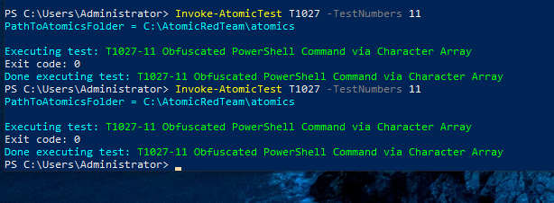
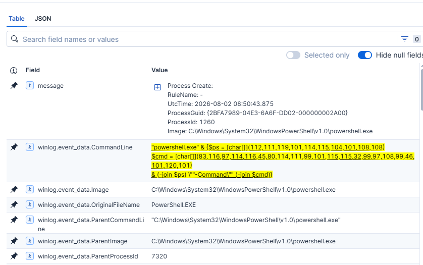
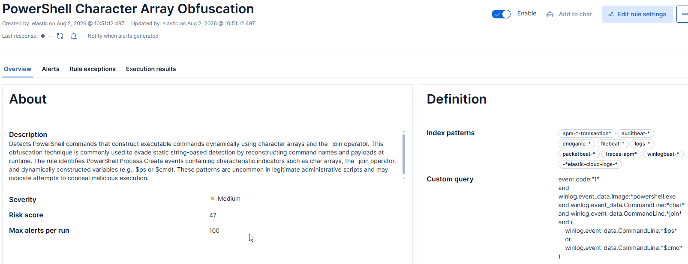
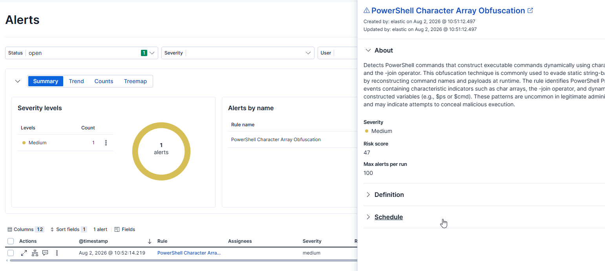

# T1027 - PowerShell Character Array Obfuscation

## Description

This project demonstrates the detection of PowerShell command obfuscation using character arrays and the `-join` operator.

Instead of executing readable commands directly, the attacker dynamically reconstructs both the PowerShell executable name and the payload at runtime from ASCII character arrays. This technique reduces the effectiveness of simple string-based detections while preserving the original functionality.

The detection was implemented as a custom Elastic Security rule and validated using Atomic Red Team.

---

# Lab Environment

| Component | Description |
|----------|-------------|
| SIEM | Elastic Security 9.x |
| Endpoint Telemetry | Sysmon |
| Log Collection | Elastic Agent |
| Target Host | Windows 10 |
| Attack Simulation | Atomic Red Team |

---

# Attack Simulation

The detection was validated using **Atomic Red Team**.

**Technique**

```
T1027
```

**Atomic Test**

```
Test #11
Obfuscated PowerShell Command via Character Array
```



The Atomic test reconstructs the PowerShell executable name and payload from ASCII character arrays before executing the final command.

Example:

```powershell
$ps = [char[]](112,111,119,101,114,115,104,101,108,108)

$cmd = [char[]](83,116,97,114,116,45,80,114,111,99,101,115,115,32,99,97,108,99,46,101,120,101)

& (-join $ps) "-Command" (-join $cmd)
```

The reconstructed payload executes:

```powershell
Start-Process calc.exe
```

---

# Investigation

Following execution of the Atomic Test, Sysmon generated a **Process Create (Event ID 1)** event.




Key indicators observed:

- PowerShell process creation
- Character array declarations (`char[]`)
- Usage of the `-join` operator
- Dynamic command reconstruction using `$ps` and `$cmd`

These artifacts were visible in the `CommandLine` field and successfully matched the detection rule.

---

# Detection Logic

The rule generates an alert when all of the following conditions are observed:

- Process Create (Sysmon Event ID 1)
- Executed process is `powershell.exe`
- Command line contains:
  - `char`
  - `join`
  - `$ps` or `$cmd`
 


## KQL

```kql
event.code:"1"
and winlog.event_data.Image:*powershell.exe
and winlog.event_data.CommandLine:*char*
and winlog.event_data.CommandLine:*join*
and (
    winlog.event_data.CommandLine:*$ps*
    or
    winlog.event_data.CommandLine:*$cmd*
)
```

---

# Comparison with Elastic Prebuilt Rule

Elastic provides a prebuilt detection named:

**Potential PowerShell Obfuscation via Concatenated Dynamic Command Invocation**

Although both detections target PowerShell obfuscation, they rely on different telemetry sources.

| Custom Detection | Elastic Prebuilt |
|-----------------|------------------|
| Sysmon Event ID 1 | PowerShell Script Block Logging (4104) |
| KQL | ES|QL |
| Process command line analysis | Script block analysis |
| Does not require PowerShell Script Block Logging | Requires PowerShell Script Block Logging |
| Detects character-array based obfuscation | Detects concatenated dynamic invocation |

This custom rule focuses on **Sysmon Process Create telemetry**, making it suitable for environments where PowerShell Script Block Logging is unavailable or disabled.

---

# Detection Result




The custom Elastic Security rule successfully generated an alert immediately after the Atomic Red Team simulation.

The alert accurately identified the PowerShell process that dynamically reconstructed its executable command using character arrays and the `-join` operator.

---
