# T1053.005 - Scheduled Task

## Overview

MITRE ATT&CK technique **T1053.005 (Scheduled Task)** describes the abuse of Windows Task Scheduler to achieve persistence, privilege escalation, or execution.

Attackers frequently create scheduled tasks that execute malicious binaries or PowerShell payloads after user logon or system startup. Modern malware families such as **QakBot** have also abused scheduled tasks to execute Base64-encoded PowerShell commands that retrieve payloads from the Windows Registry, making detection based solely on command names more difficult.

This project focuses on detecting several scheduled task creation scenarios using Sysmon Process Creation telemetry and Elastic Security custom detection rules.

---

## Lab Environment

| Component | Configuration |
|----------|---------------|
| SIEM | Elastic Stack 9.x |
| Endpoint | Windows 10 |
| Telemetry | Sysmon Event ID 1 (Process Creation) |
| Log Collection | Elastic Agent |
| Simulation | Atomic Red Team |
| Technique | MITRE ATT&CK T1053.005 |

---

# Attack Simulation

Three Atomic Red Team tests were executed.

### Test 1 – Scheduled Task Startup Script

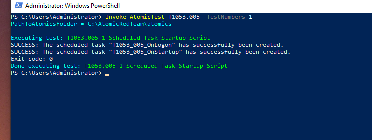

Creates two scheduled tasks using **schtasks.exe**:

- OnLogon
- OnStartup (SYSTEM)

Example command:

```cmd
schtasks /create /tn "T1053_005_OnStartup" /sc onstart /ru system /tr "cmd.exe /c calc.exe"
```

---

### Test 2 – Scheduled Task Created as SYSTEM

The detection focuses on scheduled tasks created using:

```cmd
/ru system
```

This identifies tasks configured to execute with SYSTEM privileges.

---

### Test 3 – Scheduled Task Executing Encoded PowerShell from Registry

Simulates a persistence technique observed in malware such as **QakBot**.

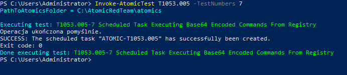

The test:

1. Stores a Base64-encoded payload inside the Windows Registry.
2. Creates a scheduled task.
3. The scheduled task launches PowerShell.
4. PowerShell retrieves the registry value.
5. The payload is decoded using **FromBase64String()**.
6. The decoded command is executed via **IEX()**.

This behavior is significantly more suspicious than a standard scheduled task because the payload is reconstructed only during execution.

---

# Investigation

Sysmon Event ID 1 captured all scheduled task creation events.

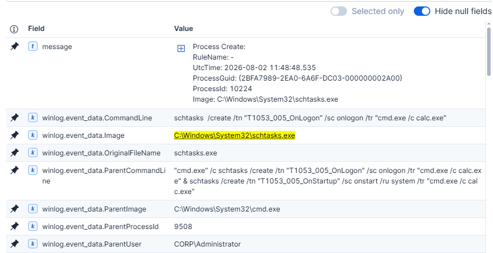

The following indicators were observed:

### Scheduled Task Creation

- Image: `schtasks.exe`
- CommandLine contains:
  - `/create`
  - `/tn`
  - `/tr`

---

### SYSTEM Scheduled Task

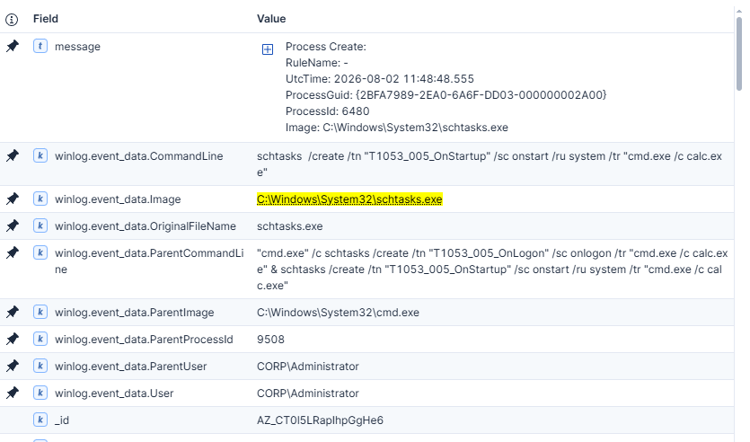

Additional indicator:

```text
/ru system
```

---

### Encoded PowerShell Task

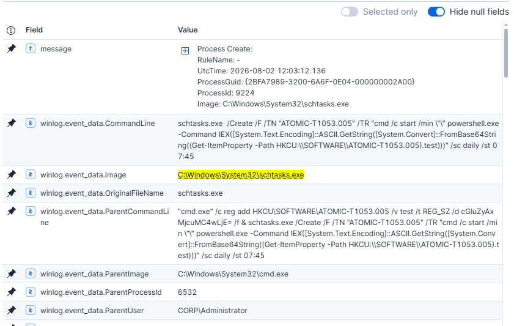

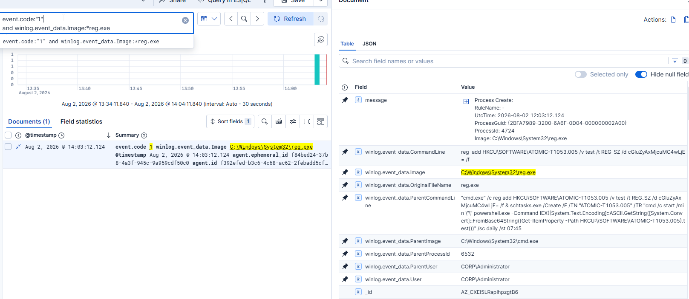

The scheduled task command line contained several strong behavioral indicators:

- `powershell.exe`
- `Get-ItemProperty`
- `FromBase64String`
- `IEX`

Rather than embedding the payload directly into the task, the payload is stored inside the registry and reconstructed only during execution.

---

# Custom Detection Rules

## Rule 1

**Scheduled Task Creation via schtasks.exe**

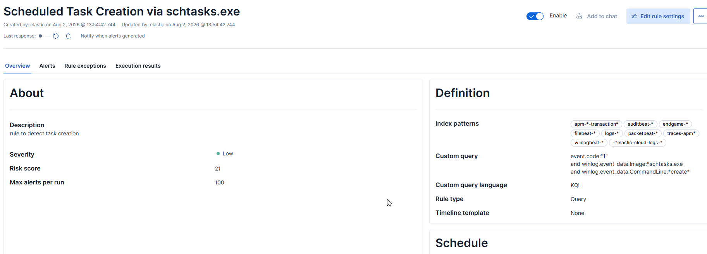

Detects creation of scheduled tasks using the native Windows utility.

```kql
event.code:"1"
and winlog.event_data.Image:*schtasks.exe
and winlog.event_data.CommandLine:*create*
```

---

## Rule 2

**Scheduled Task Created as SYSTEM**

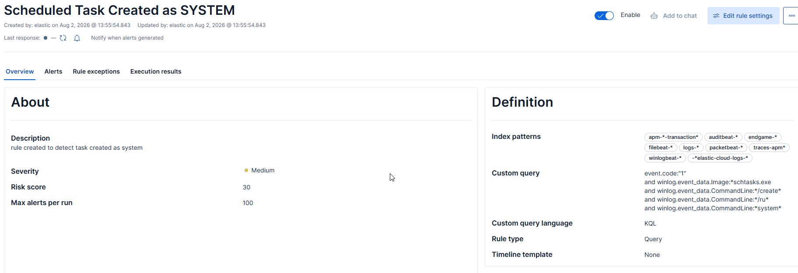

Detects scheduled tasks configured to execute under the SYSTEM account.

```kql
event.code:"1"
and winlog.event_data.Image:*schtasks.exe
and winlog.event_data.CommandLine:*create*
and winlog.event_data.CommandLine:*system*
```

---

## Rule 3

**Scheduled Task Executing Encoded PowerShell from Registry**

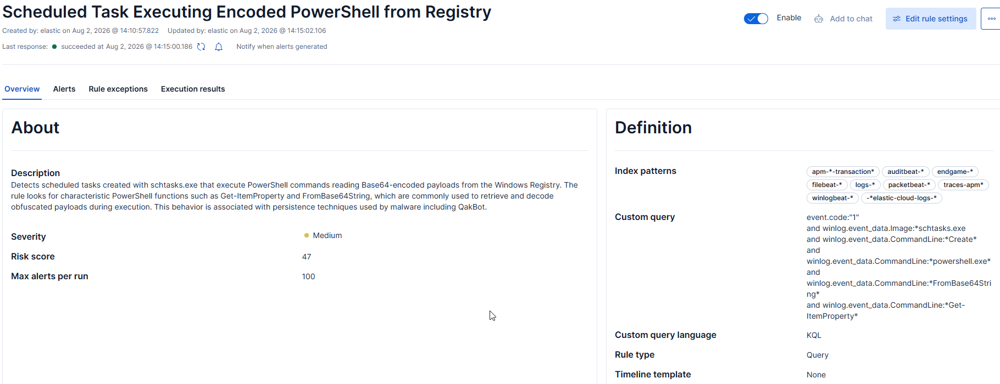

Detects scheduled tasks that retrieve Base64-encoded payloads from the Windows Registry and execute them using PowerShell.

```kql
event.code:"1"
and winlog.event_data.Image:*schtasks.exe
and winlog.event_data.CommandLine:*Create*
and winlog.event_data.CommandLine:*powershell.exe*
and winlog.event_data.CommandLine:*FromBase64String*
and winlog.event_data.CommandLine:*Get-ItemProperty*
```

---

# Detection Validation

All three detection rules successfully generated Elastic Security alerts during Atomic Red Team simulations.


- Scheduled Task Creation | ✅ Detected 

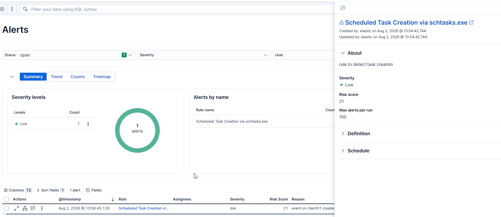

- Scheduled Task Created as SYSTEM | ✅ Detected 

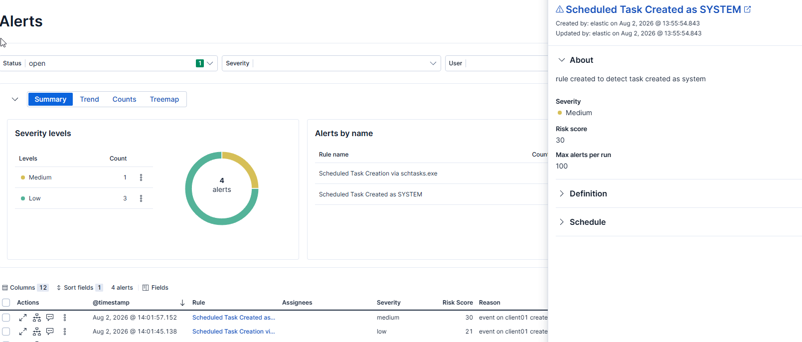

- Scheduled Task Executing Encoded PowerShell from Registry | ✅ Detected 

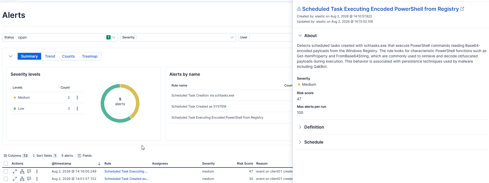

The detection based on encoded PowerShell behavior proved to be the most valuable because it identifies execution patterns rather than simply detecting the use of **schtasks.exe**.

---

# Lessons Learned

This project demonstrates how the same MITRE ATT&CK technique can be detected at different levels of specificity.

A generic rule detecting **schtasks.exe** provides broad visibility into scheduled task creation, while additional behavioral conditions—such as execution under the **SYSTEM** account or the use of **PowerShell**, **Get-ItemProperty**, and **FromBase64String**—significantly increase detection fidelity and reduce false positives.

Building multiple complementary detection rules for the same ATT&CK technique provides better coverage than relying on a single generic signature and illustrates the progression from simple process-based detection toward behavior-focused detection engineering.
