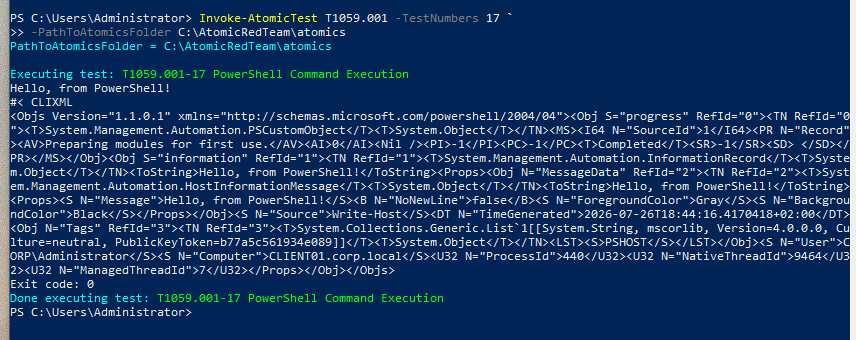

# T1059.001 – PowerShell Encoded Command Execution

## Objective

Develop and validate a custom Elastic Security detection for PowerShell execution using encoded command-line parameters. The objective of this lab was to investigate the telemetry generated by Sysmon, evaluate existing Elastic prebuilt detections, and create a custom rule capable of detecting encoded PowerShell execution in environments using Sysmon as the primary telemetry source.

---

## Lab Environment

- Windows Server 2022 (Active Directory)
- Windows 10 Client
- Ubuntu Server
- Elastic Stack 9.4
- Elastic Agent
- Sysmon
- Atomic Red Team

---

## MITRE ATT&CK

| Tactic | Technique |
|---------|-----------|
| Execution (TA0002) | T1059.001 – PowerShell |

---

## Attack Simulation

Atomic Red Team test executed:



The test executes an obfuscated PowerShell command using the `-EncodedCommand` (`-e`) parameter, simulating a common attacker technique used to hide malicious PowerShell payloads.

---

## Investigation

Elastic Discover was used to analyze the generated Sysmon telemetry.

The following Process Create event was identified:

- Event ID: **1 (Process Create)**
- Image: `C:\Windows\System32\WindowsPowerShell\v1.0\powershell.exe`
- OriginalFileName: `PowerShell.EXE`
- Parent Image: `C:\Windows\System32\cmd.exe`
- Command Line:
  ```text
  powershell.exe -e <Base64 Encoded Command>
  ```

The investigation confirmed that Sysmon preserved the complete encoded command line, making it possible to reliably detect encoded PowerShell execution.

---

## Prebuilt Elastic Detection Analysis

Before creating a custom detection, the available Elastic prebuilt rules were reviewed.

A relevant rule was identified:

**Long Base64 Encoded Command via Scripting Interpreter**

However, this rule did not generate an alert during testing.

Further investigation showed that the rule is designed for **Elastic Defend endpoint telemetry** (`logs-endpoint.events.process-*`) rather than Sysmon events.

Additionally, the rule specifically targets **very large Base64 payloads** by requiring command lines with a length of at least **4000 characters**.

```kql
| EVAL Esql.length_cmdline = LENGTH(command_line)
| WHERE Esql.length_cmdline >= 4000
| KEEP *
```


Since the Atomic Red Team test generates a significantly shorter encoded command, the prebuilt rule did not trigger.

This behavior is expected and demonstrates that the Elastic rule is intended to detect heavily obfuscated payloads rather than every use of PowerShell's encoded command functionality.

---

## Custom Detection Rule

A custom KQL rule was created using Sysmon Process Create events.

```kql
event.code:1 and
winlog.event_data.OriginalFileName:"PowerShell.EXE" and
(
  winlog.event_data.CommandLine:*-e* or
  winlog.event_data.CommandLine:*-enc* or
  winlog.event_data.CommandLine:*-encodedcommand*
)
```

The rule detects PowerShell execution using encoded command-line parameters regardless of payload size.


---

## Detection Validation

The Atomic Red Team test was executed again after deploying the custom rule.

Elastic Security successfully generated an alert:

**PowerShell Encoded Command Execution**

The generated alert matched the expected Sysmon Process Create event, confirming that the detection functions correctly.


---


## Conclusion


The investigation showed that Elastic already provides a similar prebuilt detection, but it is designed for Elastic Defend telemetry and focuses on oversized Base64 payloads.

A custom Sysmon-based detection was therefore developed to provide broader coverage for environments that rely on Sysmon instead of Elastic Defend, while still detecting one of the most common PowerShell execution techniques observed in real-world attacks.
