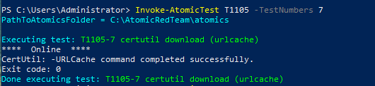
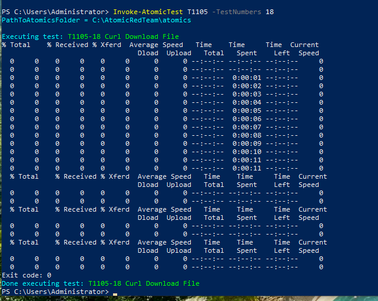
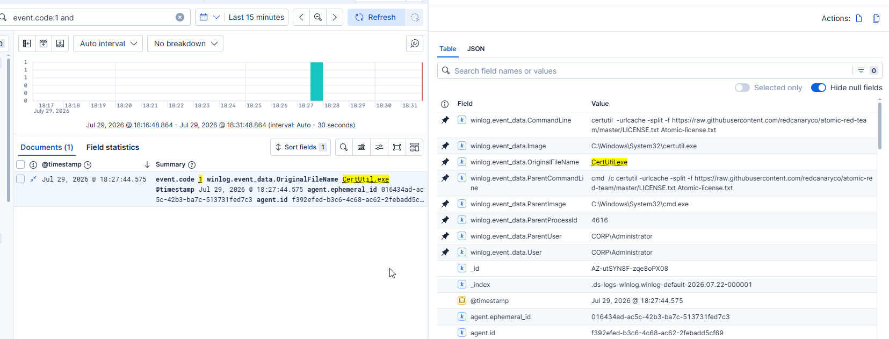
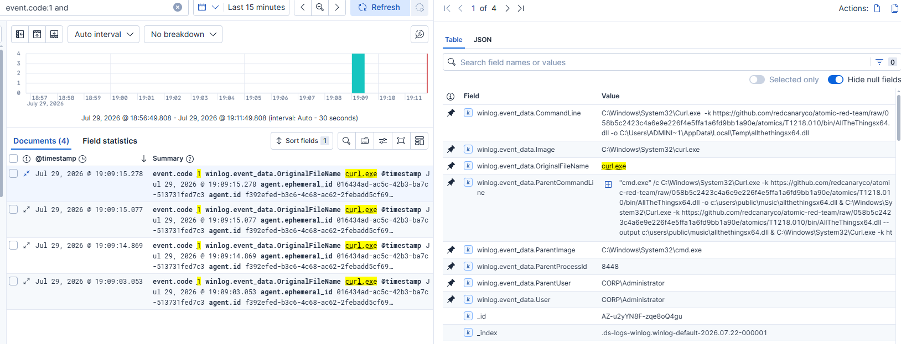
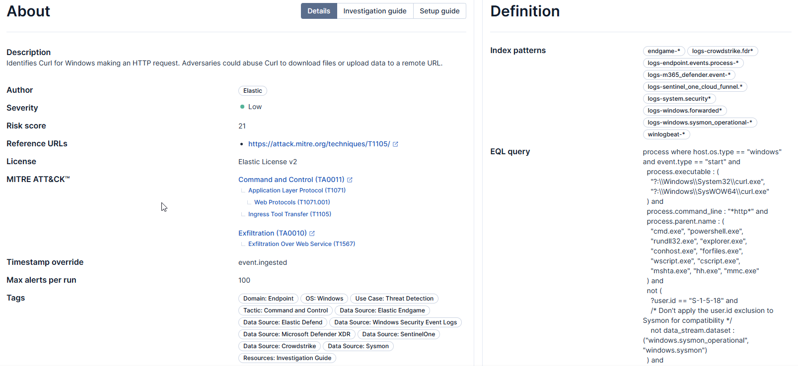
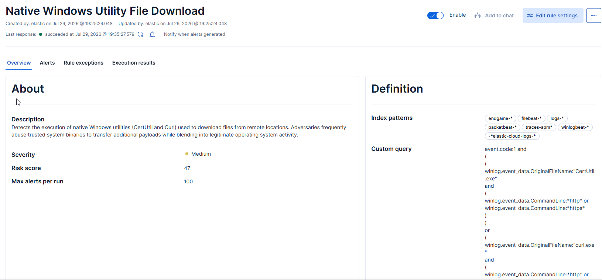
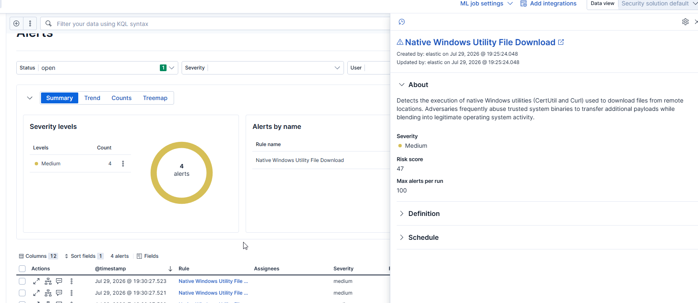

# T1105 - Ingress Tool Transfer

## Overview

This project demonstrates the detection of **MITRE ATT&CK T1105 - Ingress Tool Transfer** by identifying the abuse of native Windows utilities commonly used to download files from remote locations.

Instead of creating separate detections for individual binaries, this project combines multiple native Windows utilities into a single behavioral detection.

The following utilities were analyzed:

- CertUtil (`certutil.exe`)
- Curl (`curl.exe`)

---
# Lab Environment

| Component | Value |
|-----------|-------|
| SIEM | Elastic Stack 9.4 |
| Endpoint | Windows 10 Pro |
| Telemetry | Sysmon + Elastic Agent |
| Attack Framework | Atomic Red Team |
| Technique | MITRE ATT&CK T1105 |

---

# Attack Simulation

## Atomic Test #7 - CertUtil Download (urlcache)

The first simulation used **CertUtil**, a legitimate Windows utility frequently abused by adversaries to download payloads from remote locations.

```cmd
certutil -urlcache -split -f https://raw.githubusercontent.com/redcanaryco/atomic-red-team/master/LICENSE.txt Atomic-license.txt
```




---

## Atomic Test #18 - Curl Download

The second simulation used the native Windows implementation of **curl.exe** to download a remote file.

The Atomic Red Team test executed multiple download variations using different output locations.




---

# Investigation

Both attack simulations generated **Sysmon Process Create (Event ID 1)** events that were successfully collected by Elastic.

---

## CertUtil Investigation

The following fields were analyzed:

- Image
- OriginalFileName
- CommandLine
- ParentImage
- ParentCommandLine
- User

Observed telemetry:

| Field | Value |
|--------|-------|
| Image | `C:\Windows\System32\certutil.exe` |
| OriginalFileName | `CertUtil.exe` |
| Parent Process | `cmd.exe` |
| User | `CORP\Administrator` |

Key observations:

- Command line contained the complete download URL.
- The downloaded filename was visible.
- The arguments `-urlcache`, `-split`, and `-f` were present.




---

## Curl Investigation

The following fields were analyzed:

- Image
- OriginalFileName
- CommandLine
- ParentImage
- ParentCommandLine
- User

Observed telemetry:

| Field | Value |
|--------|-------|
| Image | `C:\Windows\System32\curl.exe` |
| OriginalFileName | `curl.exe` |
| Parent Process | `cmd.exe` |
| User | `CORP\Administrator` |

Key observations:

- Complete download URL visible in the command line.
- Output file location visible.
- Download arguments (`-o`, `--output`) present.
- Multiple Process Create events generated due to multiple Atomic download variants.




---

# Detection Strategy

Although **CertUtil** and **Curl** are different binaries, they perform the same attacker objective:

> Download a file from a remote location using trusted native Windows utilities.

Instead of detecting individual commands, the custom detection focuses on identifying multiple native utilities commonly abused for **Ingress Tool Transfer**.

Behavioral indicators include:

- Native Windows download utility execution
- HTTP/HTTPS URLs present in the command line
- Sysmon Process Create (Event ID 1)
- Native Microsoft binaries executing remote file downloads

---

# Prebuilt Elastic Detection Analysis

Elastic provides a prebuilt detection rule named **Potential File Transfer via Curl for Windows**.

The prebuilt rule focuses specifically on detecting **curl.exe** making HTTP requests and includes additional production-oriented logic such as:

- expected parent processes
- exclusions for SYSTEM accounts
- integrity level filtering

This project expands the detection scope by identifying multiple native Windows utilities instead of a single executable.

| Elastic Prebuilt Rule | Custom Rule |
|------------------------|------------|
| Detects Curl only | Detects CertUtil and Curl |
| Production-focused filtering | Behavioral coverage for multiple LOLBins |
| Single binary | Multiple native Windows utilities |

### Prebuilt Rule 



---

# Custom Detection Rule

## Rule Name

**Native Windows Utility File Download**

---

## Rule Description

Detects the execution of native Windows utilities (CertUtil and Curl) used to download files from remote locations. Adversaries frequently abuse trusted system binaries to transfer additional payloads while blending into legitimate operating system activity.

---

## Rule Logic

```kql
event.code:1 and
(
(
winlog.event_data.OriginalFileName:"CertUtil.exe"
and
(
winlog.event_data.CommandLine:*http* or
winlog.event_data.CommandLine:*https*
)
)
or
(
winlog.event_data.OriginalFileName:"curl.exe"
and
(
winlog.event_data.CommandLine:*http* or
winlog.event_data.CommandLine:*https*
)
)
)
```

---

## Rule Configuration

| Setting | Value |
|----------|-------|
| Rule Type | Query |
| Severity | Medium |
| Risk Score | 47 |
| MITRE ATT&CK | T1105 |




---

# Detection Validation

The detection rule was validated against both Atomic Red Team simulations.

| Test | Result |
|------|--------|
| Atomic Test #7 - CertUtil | ✅ Alert Generated |
| Atomic Test #18 - Curl | ✅ Alert Generated |

The rule successfully detected all simulated executions of native Windows utilities used for remote file downloads.




---

# Detection Improvements

Future improvements could include:

- Support for **Invoke-WebRequest**
- Support for **WebClient.DownloadFile**
- Detection of **BITSAdmin** transfers
- Detection of **MpCmdRun.exe**
- Detection of **certreq.exe**
- Correlation with network connection events
- Parent process filtering to reduce false positives
- Environment-specific allowlists for administrative activity

---

# Conclusion

This project demonstrates a behavioral detection for **MITRE ATT&CK T1105 – Ingress Tool Transfer** by identifying multiple native Windows utilities commonly abused for downloading remote files.

Unlike a binary-specific detection, the custom rule provides broader coverage by detecting both **CertUtil** and **Curl** using shared behavioral characteristics observed in Sysmon Process Create telemetry.

The detection successfully identified every simulated execution, providing a scalable foundation for expanding coverage to additional native Windows utilities frequently abused by adversaries.
