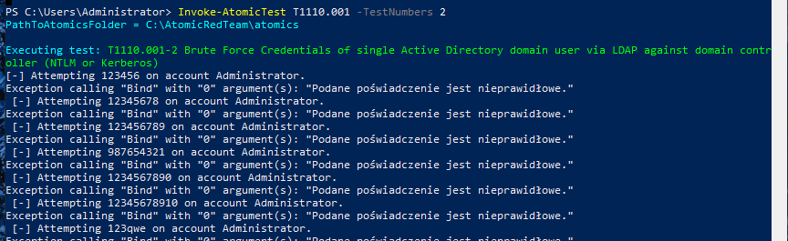
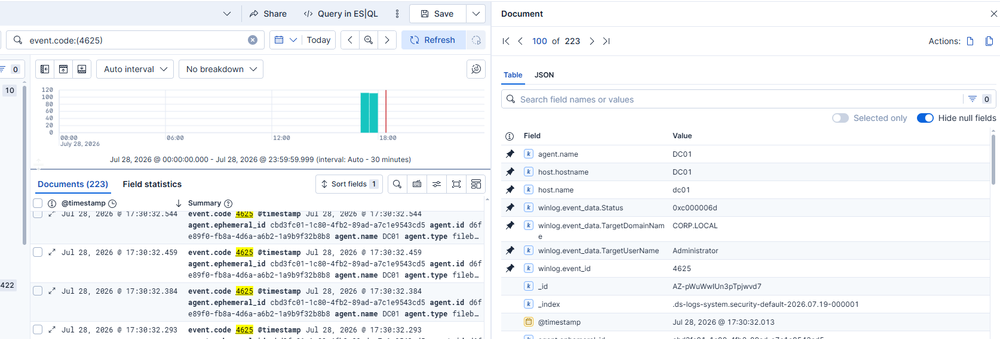
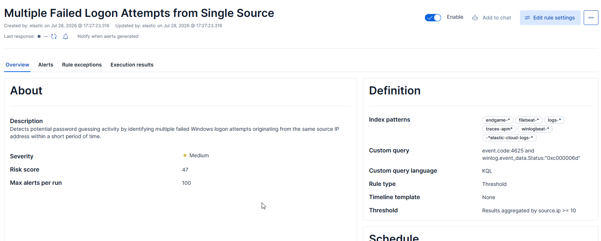
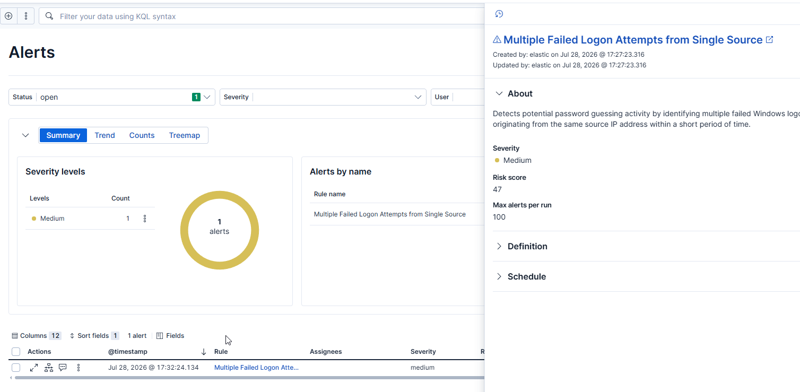

# T1110.001 - Password Guessing

## MITRE ATT&CK

**Technique:** T1110.001 - Password Guessing

**Tactic:** Credential Access

---
# Lab Environment

| Component | Value |
|-----------|-------|
| SIEM | Elastic Stack 9.4 |
| Endpoint | Windows 10 Pro |
| Telemetry | Sysmon + Elastic Agent |
| Attack Framework | Atomic Red Team |
| Technique | MITRE ATT&CK T1110.001 |

---

# Attack Simulation

Password Guessing activity was simulated using **Atomic Red Team Test #2**, which performs repeated LDAP authentication attempts against an Active Directory Domain Controller using invalid credentials.

Unlike the SMB-based Atomic test, the LDAP simulation successfully generated failed authentication events (Event ID 4625), providing a realistic dataset for detection engineering.

**Atomic Test**

```powershell
Invoke-AtomicTest T1110.001 -TestNumbers 2
```



---

# Investigation

After executing the Atomic test, the generated Windows Security Events were analyzed in Elastic Discover.

The attack generated multiple **Event ID 4625 (Failed Logon)** events originating from the same source IP address within a short period of time.

The following fields were particularly useful during the investigation:

| Field | Description |
|--------|-------------|
| event.code | Failed Windows logon (4625) |
| winlog.event_data.TargetUserName | Target account |
| winlog.event_data.TargetDomainName | Target domain |
| winlog.event_data.Status | Failure reason (0xc000006d - Bad credentials) |
| source.ip | Source of authentication attempts |
| agent.name | Domain Controller collecting the event |

The repeated failed authentication attempts clearly indicate password guessing activity rather than a normal user mistake.



---

# Prebuilt Elastic Detection Analysis

Elastic provides several prebuilt rules related to Windows authentication activity and brute force attacks.

These rules typically detect repeated failed authentication attempts by correlating multiple failed logon events over a configurable time window.

While the built-in rules provide broad coverage, this project demonstrates how a custom threshold-based rule can be created specifically for Windows password guessing scenarios.

---

# Custom Detection Rule

Unlike a simple event-based rule that triggers on every failed logon, this custom rule uses **Threshold Detection**.

The rule generates an alert only when:

- at least **10 failed logon attempts**
- occur within **5 minutes**
- from the same **source.ip**

### KQL Query

```kql
event.code:4625 and
winlog.event_data.Status:"0xc000006d"
```

### Threshold Configuration

| Setting | Value |
|----------|-------|
| Rule Type | Threshold |
| Threshold | 10 |
| Time Window | 5 minutes |
| Group By | source.ip |

This approach significantly reduces false positives generated by occasional user mistakes while remaining effective against password guessing attacks.

### Screenshot



---

# Detection Validation

The Atomic Red Team LDAP Password Guessing test was executed once again after enabling the custom detection rule.

The attack generated dozens of Windows Event ID 4625 events.

Once the threshold condition was met, Elastic successfully generated a **single alert**, indicating multiple failed logon attempts from the same source IP.

This confirms that the custom rule correctly detects password guessing activity while avoiding alert fatigue caused by individual failed authentication attempts.

### Screenshot



---

# Conclusion

This project demonstrates the complete detection engineering workflow for **MITRE ATT&CK T1110.001 - Password Guessing**.

Instead of relying on a simple Event ID match, the detection was implemented using a **Threshold Rule**, allowing multiple authentication failures to be correlated into a single high-value alert.

This technique more accurately reflects how brute force and password guessing attacks are detected in production SOC environments by reducing false positives and focusing analyst attention on suspicious authentication patterns.

## Detection Logic

The detection is based on the following logic:

1. Monitor failed Windows logon events (Event ID 4625).
2. Filter authentication failures caused by invalid credentials (Status: 0xc000006d).
3. Count authentication failures originating from the same source IP.
4. Generate a single alert when at least 10 failed logons occur within a 5-minute period.
