# T1547.001 - Winlogon and Registry Run Key Persistence Detection 
## Overview

This project demonstrates the detection of multiple Windows persistence mechanisms associated with **MITRE ATT&CK T1547.001 – Registry Run Keys / Startup Folder**.

The objective was to simulate several common persistence techniques using Atomic Red Team, analyze the generated Sysmon telemetry, and develop custom Elastic Security detection rules capable of identifying each technique with minimal false positives.

The lab covers multiple persistence methods frequently abused by attackers, including:

- Windows Run registry keys
- PowerShell-based Run key modifications
- Explorer Policy Run keys
- Winlogon Userinit modifications
- Winlogon Shell modifications

---

# Lab Environment

| Component | Purpose |
|-----------|---------|

| Windows 10 Client | Attack simulation target |
| Sysmon | Windows event collection |
| Elasticsearch + Kibana | Log analysis and alerting |
| Atomic Red Team | Attack simulation |

---

# Attack Simulation & Investigation

Five Atomic Red Team tests were executed to emulate different persistence mechanisms.

---

## 1. Windows Run Registry Key

### Atomic Test

**Technique:** T1547.001  
**Atomic Test:** Test #1 – Reg Key Run

The attack creates a new registry value inside:

```text
HKCU\Software\Microsoft\Windows\CurrentVersion\Run
```

allowing a program to execute automatically whenever the user logs on.

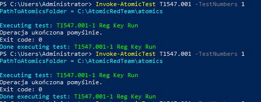

---

### Investigation

Sysmon generated:

- Event ID 1 – Process Creation
- Event ID 13 – Registry Value Set

The Process Creation event showed **reg.exe** creating the persistence entry.

The Registry Value Set event confirmed the modification of the Windows Run registry key.

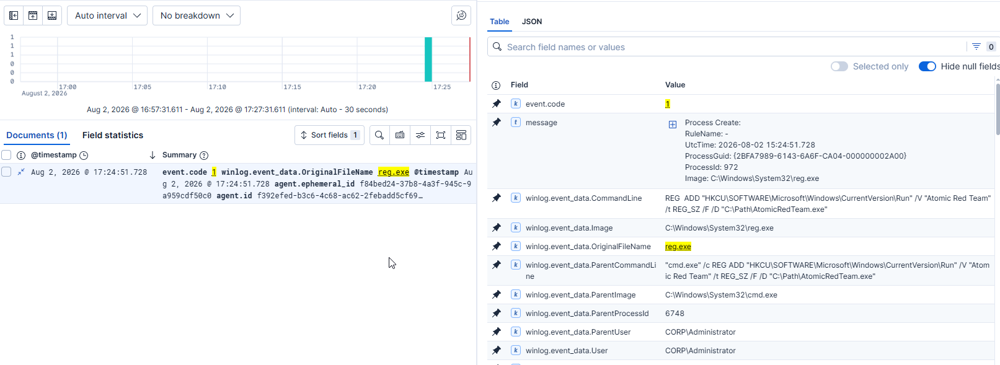

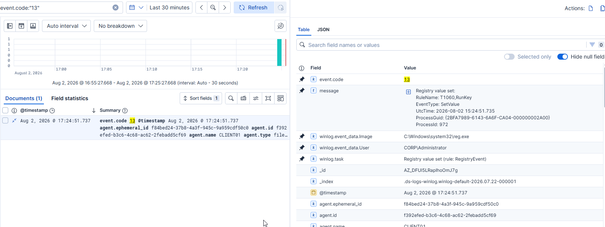

---

## Custom Detection Rule

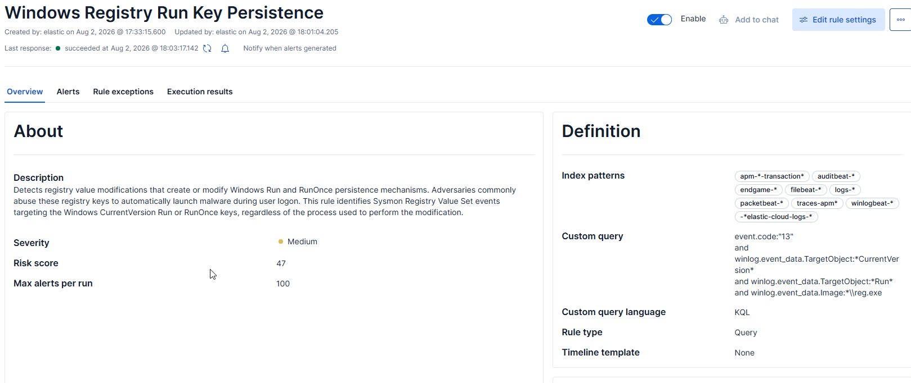

```kql
event.code:"13"
and winlog.event_data.TargetObject:*CurrentVersion*
and winlog.event_data.TargetObject:*Run*
and winlog.event_data.Image:*\\reg.exe
```

---

## Detection Validation

The detection rule successfully generated an alert immediately after the Run key was modified.

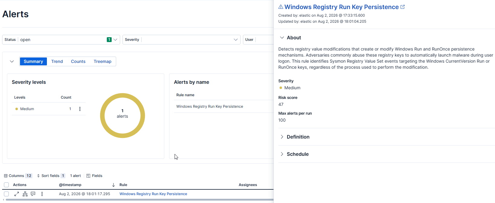

---

## 2. PowerShell Run Key Modification

### Atomic Test

**Technique:** T1547.001  
**Atomic Test:** Test #9 – SystemBC Malware-as-a-Service Registry

Instead of using **reg.exe**, this test modifies the Run registry key through **PowerShell Set-ItemProperty**.

The persistence entry is written to:

```text
HKCU\Software\Microsoft\Windows\CurrentVersion\Run
```

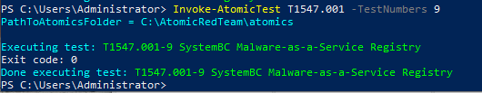

---

### Investigation

Sysmon Event ID 1 captured the PowerShell process.

The CommandLine field clearly showed the **Set-ItemProperty** command modifying the Run key.


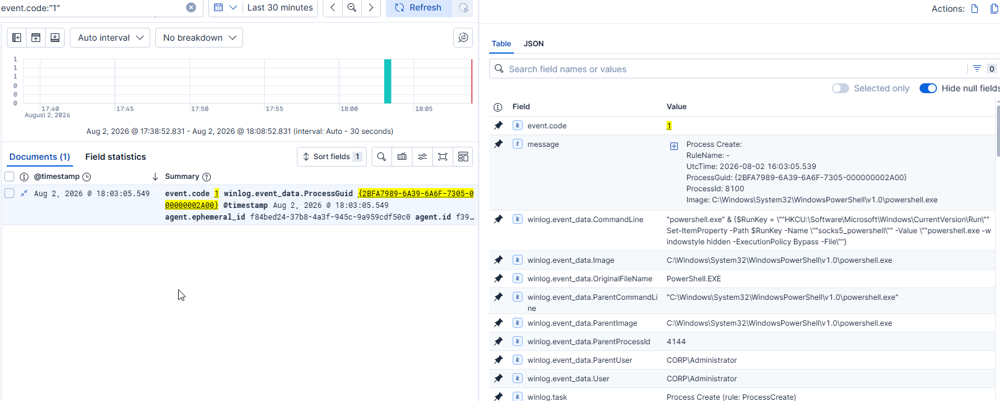

---

## Custom Detection Rule

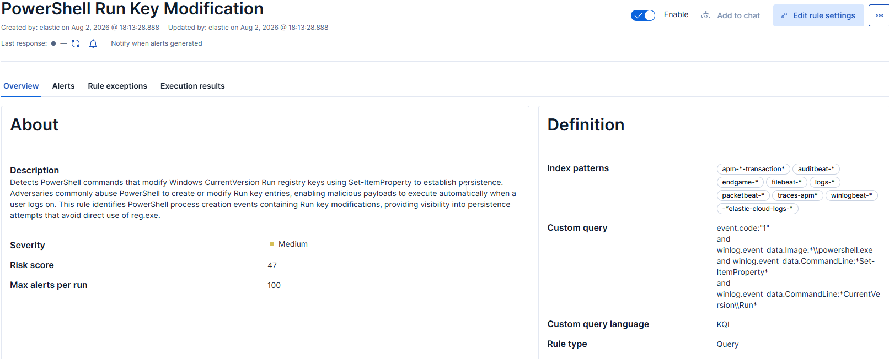

```kql
event.code:"1"
and winlog.event_data.Image:*powershell.exe
and winlog.event_data.CommandLine:*Set-ItemProperty*
and winlog.event_data.CommandLine:*CurrentVersion*
and winlog.event_data.CommandLine:*Run*
```

---

## Detection Validation

The custom rule successfully detected PowerShell-based Run key persistence attempts.

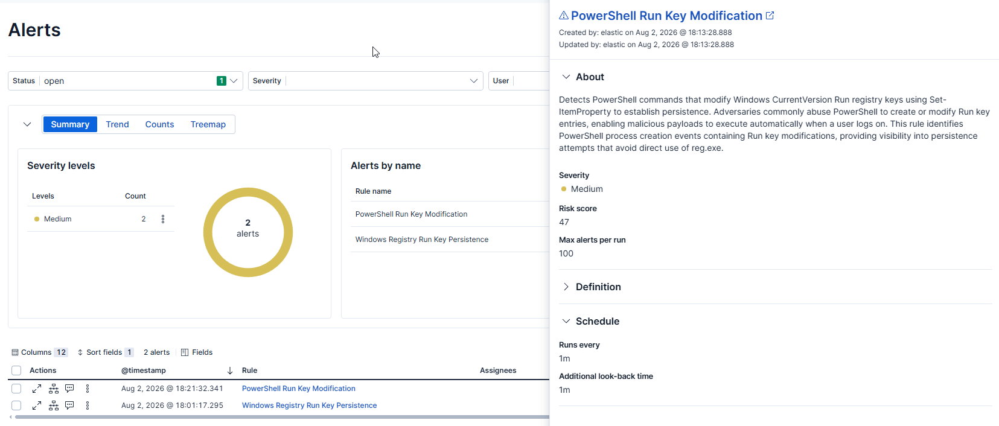

---

## 3. Explorer Policy Run Key Persistence

### Atomic Test

**Technique:** T1547.001  
**Atomic Test:** Test #12 – HKCU Policy Settings Explorer Run Key

The attack creates persistence inside the following registry location:

```text
HKCU\Software\Microsoft\Windows\CurrentVersion\Policies\Explorer\Run
```

This location is less commonly monitored than the standard Run key.

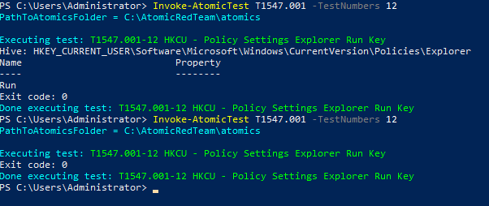

---

### Investigation

Sysmon Event ID 13 recorded the registry modification.

The TargetObject field clearly identified the modified key:

```text
Policies\Explorer\Run
```

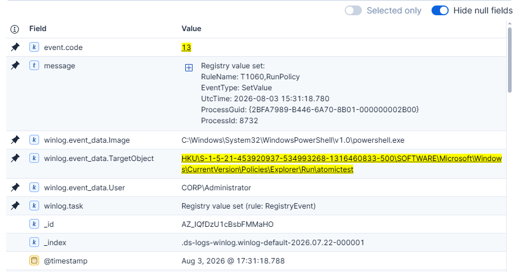

---

## Custom Detection Rule

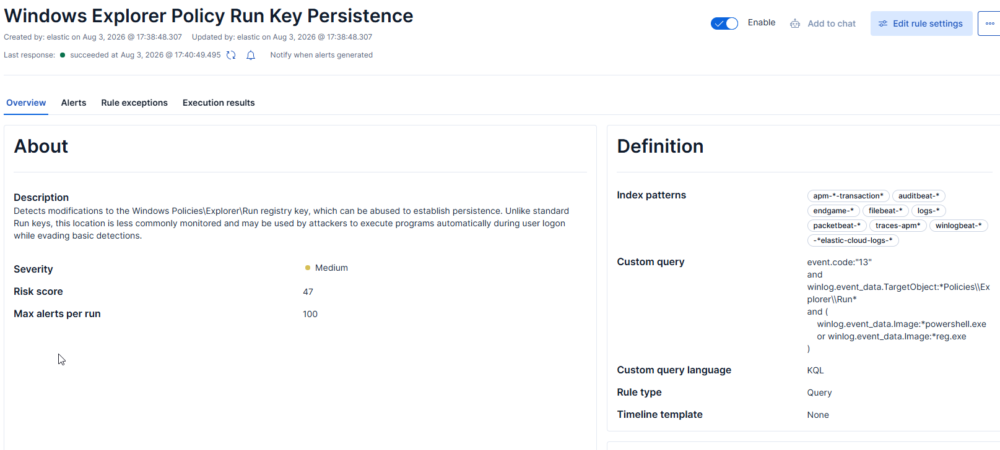

```kql
event.code:"13"
and winlog.event_data.TargetObject:*Policies\\Explorer\\Run*
and(winlog.event_data.Image:*powershell.exe
    or winlog.event_data.Image:*reg.exe)
```

---

## Detection Validation

The detection rule successfully identified modifications to the Explorer Policy Run key.

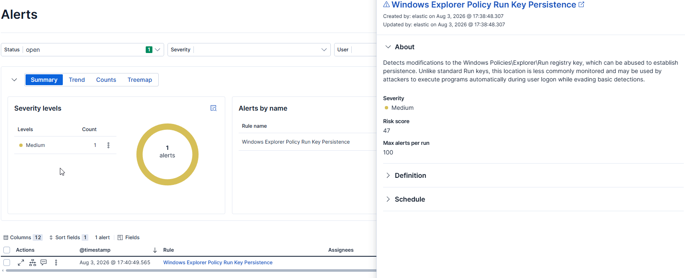

---

## 4. Winlogon Userinit Modification

### Atomic Test

**Technique:** T1547.001  
**Atomic Test:** Test #14 – HKLM Append Command to Winlogon Userinit

The Atomic test appends an executable to the **Userinit** registry value.

This persistence mechanism allows arbitrary programs to launch whenever a user logs on.

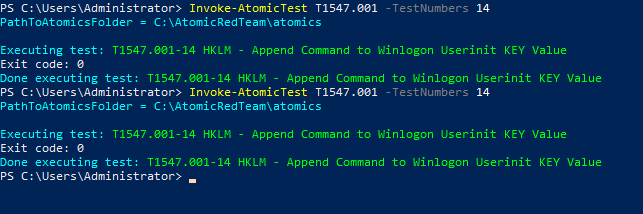

---

### Investigation

Sysmon Event ID 1 captured the PowerShell process responsible for modifying the registry.

Sysmon Event ID 13 generated two registry events:

- Userinit-backup
- Userinit

The detection rule ignores the backup value and alerts only when the actual **Userinit** value is modified.

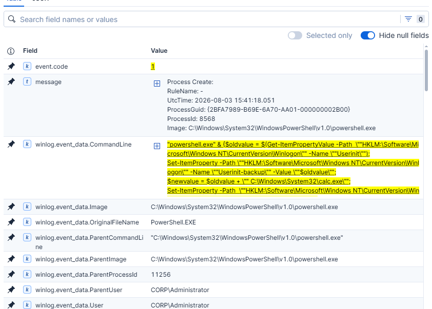

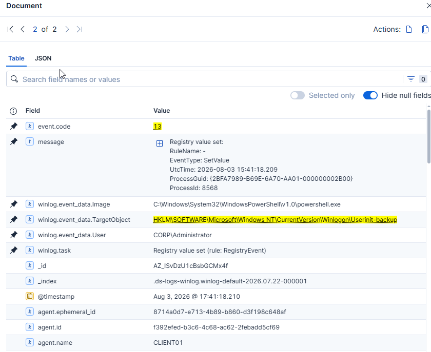

---

## Custom Detection Rule

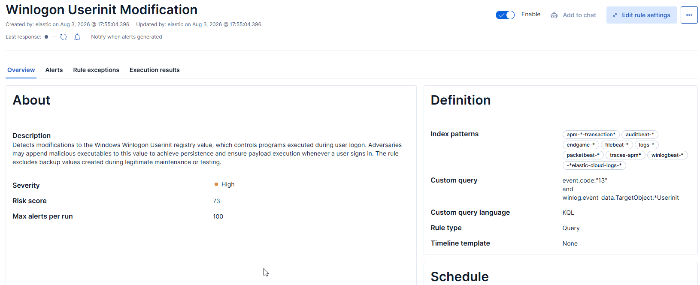

```kql
event.code:"13"
and winlog.event_data.TargetObject:*Winlogon*
and winlog.event_data.TargetObject:*Userinit*
and not winlog.event_data.TargetObject:*backup*
```

---

## Detection Validation

The rule successfully detected the Userinit modification while ignoring the backup registry value created by the Atomic test.

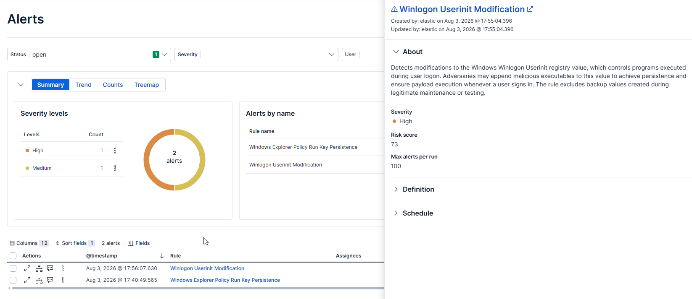

---

## 5. Winlogon Shell Modification

### Atomic Test

**Technique:** T1547.001  
**Atomic Test:** Test #15 – HKLM Modify Winlogon Shell

The test modifies the **Shell** registry value located under the Winlogon registry key.

Changing this value allows attackers to replace or append the default Windows shell, enabling code execution whenever a user signs in.

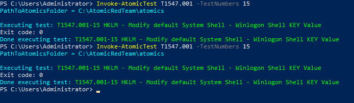

---

### Investigation

Sysmon Event ID 1 captured the PowerShell command responsible for reading, backing up and modifying the Shell registry value.

Sysmon Event ID 13 confirmed that the Winlogon Shell registry value had been updated.

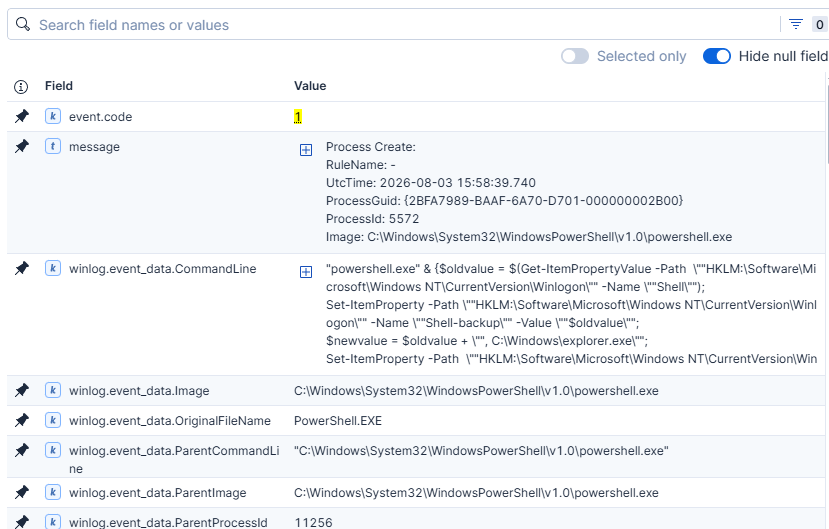

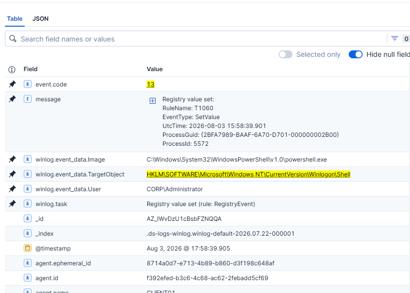

---

## Custom Detection Rule

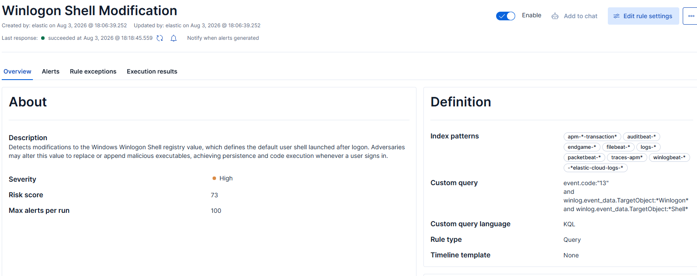

```kql
event.code:"13"
and winlog.event_data.TargetObject:*Winlogon*
and winlog.event_data.TargetObject:*Shell*
and not winlog.event_data.TargetObject:*backup*
```

---

## Detection Validation

The detection rule successfully generated a high-severity alert after the Winlogon Shell registry value was modified.

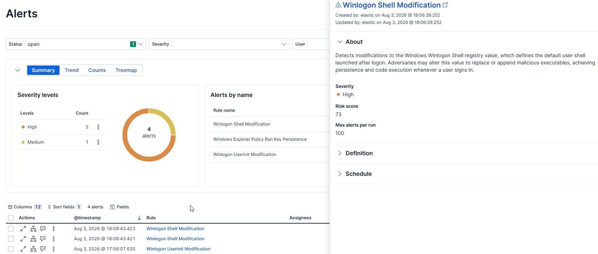

---

# Conclusion

This project demonstrates the creation of multiple custom Elastic Security detection rules covering several persistence mechanisms associated with **MITRE ATT&CK T1547.001 – Registry Run Keys / Startup Folder**.

Each Atomic Red Team simulation was investigated using Sysmon telemetry, validated in Kibana Discover, and ultimately detected through dedicated Elastic Security rules.

The project highlights the importance of correlating **Sysmon Event ID 1 (Process Creation)** with **Sysmon Event ID 13 (Registry Value Set)**. Registry events reveal *what* persistence was established, while process creation events identify *how* the persistence was created and which process was responsible.
