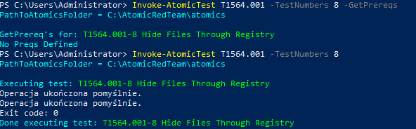
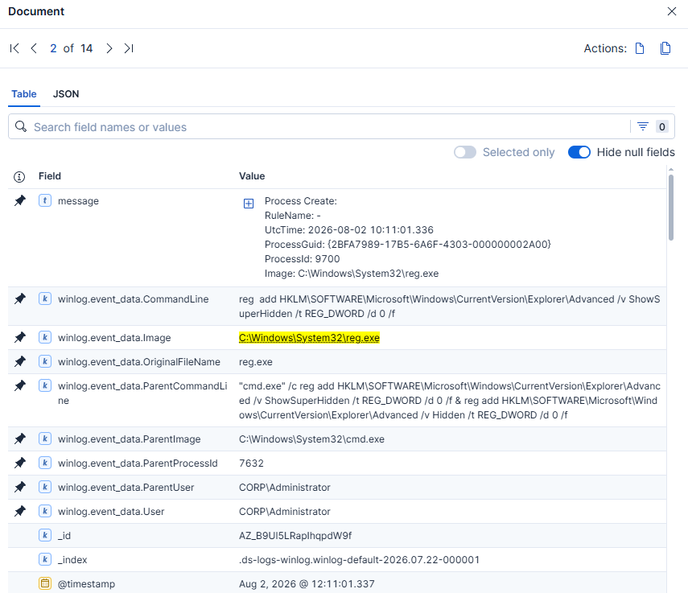
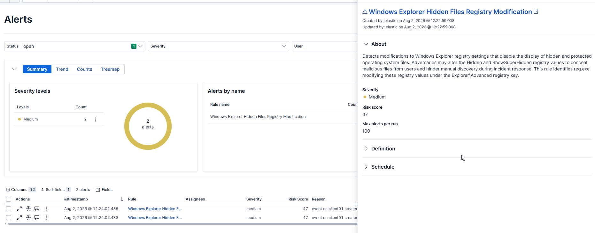
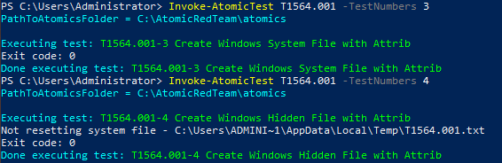
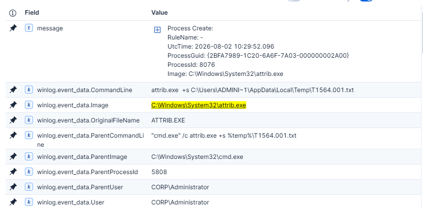
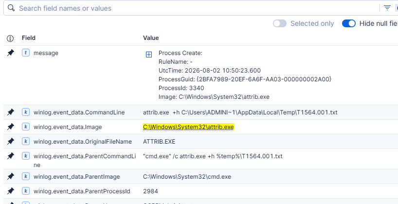
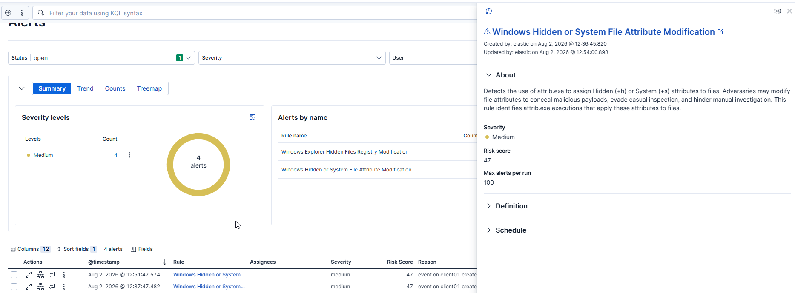

# T1564.001 – Hide Artifacts: Hidden Files and Directories

## Overview

This project demonstrates two different detection approaches for identifying attempts to hide artifacts on Windows systems. Both detections focus on MITRE ATT&CK technique **T1564.001 – Hide Artifacts: Hidden Files and Directories**.

The first rule detects modifications to Windows Explorer registry settings that prevent users from viewing hidden and protected operating system files. The second rule detects the use of `attrib.exe` to assign Hidden and System attributes to files.

---

# Lab Environment

| Component | Value |
|-----------|-------|
| SIEM | Elastic Stack 9.4 |
| Endpoint | Windows 10 Pro |
| Telemetry | Sysmon + Elastic Agent |
| Attack Framework | Atomic Red Team |
| Technique | MITRE ATT&CK T1087.001 |

---

# Attack Simulation #1

## Windows Explorer Registry Modification

**MITRE ATT&CK**

T1564.001 – Hide Artifacts: Hidden Files and Directories

### Atomic Test

Atomic Red Team

Test **#8 – Hide Files Through Registry**



The simulation modifies Windows Explorer registry settings responsible for displaying hidden and protected operating system files.

Executed commands:

```cmd
reg add HKLM\SOFTWARE\Microsoft\Windows\CurrentVersion\Explorer\Advanced /v ShowSuperHidden /t REG_DWORD /d 0 /f

reg add HKLM\SOFTWARE\Microsoft\Windows\CurrentVersion\Explorer\Advanced /v Hidden /t REG_DWORD /d 0 /f
```

---

# Investigation

Sysmon Event ID 1 recorded two separate executions of **reg.exe**, each modifying one registry value.

Interesting fields:

- Image
- OriginalFileName
- CommandLine
- ParentImage
- ParentCommandLine

The registry modifications target Windows Explorer configuration under:

```
HKLM\SOFTWARE\Microsoft\Windows\CurrentVersion\Explorer\Advanced
```

Changing these values prevents Explorer from displaying hidden and protected operating system files, making malicious files significantly harder for users to discover manually.




---

# Detection Logic

## KQL

```kql
event.code:"1"
and winlog.event_data.OriginalFileName:"REG.EXE"
and winlog.event_data.CommandLine:*Explorer\\Advanced*
and (
    winlog.event_data.CommandLine:*ShowSuperHidden*
    or
    winlog.event_data.CommandLine:*Hidden*
)
and winlog.event_data.CommandLine:*/d*
and winlog.event_data.CommandLine:*0*
```

---

# Detection Results

The rule successfully generated alerts for both registry modifications performed during the Atomic Red Team simulation.



---

# Attack Simulation #2

## Hidden/System File Attributes

**MITRE ATT&CK**

T1564.001 – Hide Artifacts: Hidden Files and Directories

### Atomic Tests

Atomic Red Team

- Test **#3 – Create Windows System File with Attrib**
- Test **#4 – Create Windows Hidden File with Attrib**



Executed commands:

```cmd
attrib.exe +s %temp%\T1564.001.txt

attrib.exe +h %temp%\T1564.001.txt
```

---

# Investigation

Sysmon captured execution of **attrib.exe**, showing both the applied attribute and the modified file.

Interesting fields:

- Image
- OriginalFileName
- CommandLine
- ParentImage
- ParentCommandLine

The commands assign either the **System (+s)** or **Hidden (+h)** attribute to the target file.

These attributes are commonly abused by malware to reduce visibility of malicious payloads and evade casual inspection.





---

# Detection Logic

## KQL

```kql
event.code:"1"
and winlog.event_data.OriginalFileName:"ATTRIB.EXE"
and (
    winlog.event_data.CommandLine:*+h*
    or
    winlog.event_data.CommandLine:*+s*
)
```

---

# Detection Results

The rule successfully detected both Atomic Red Team simulations using Hidden (+h) and System (+s) file attributes.



---

# Comparison

| Detection | Registry Modification | attrib.exe |
|-----------|----------------------|------------|
| Registry changes | ✅ | ❌ |
| File attribute changes | ❌ | ✅ |
| Atomic Tests | #8 | #3, #4 |

Both detection rules complement each other by identifying different approaches used to achieve the same ATT&CK objective: hiding artifacts from users and defenders.

---

# Lessons Learned

This project demonstrates that the same ATT&CK technique can be implemented using multiple operating system features.

Instead of relying on a single detection, combining multiple rules provides broader visibility into attacker behavior.

The registry-based rule detects attempts to hide files by modifying Windows Explorer configuration, while the `attrib.exe` rule identifies direct manipulation of file attributes. Together, they improve coverage for T1564.001 and illustrate how layered detections can better represent real-world attack scenarios.
