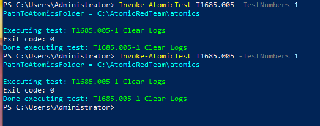
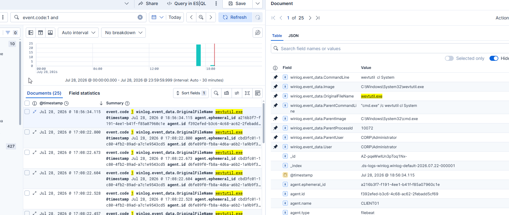
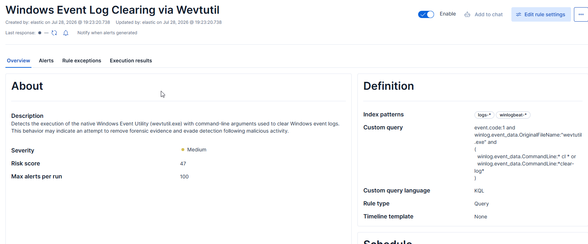
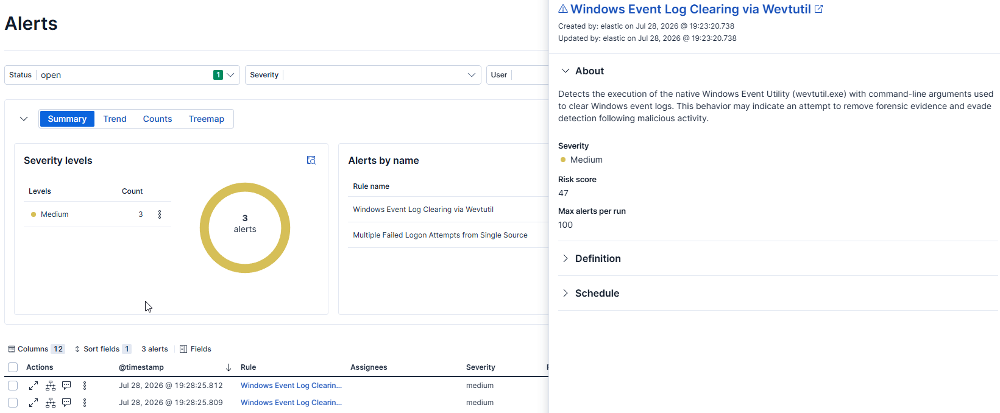

# T1685.005 - Disable or Modify Tools: Clear Windows Event Logs

## Attack Simulation

This project demonstrates the simulation of MITRE ATT&CK technique **T1685.005 - Disable or Modify Tools: Clear Windows Event Logs** using Atomic Red Team.

The first Atomic test was executed, which clears a Windows Event Log using the native **wevtutil.exe** utility.

```cmd
wevtutil cl System
```


---

## Investigation

The attack generated a **Sysmon Process Create (Event ID 1)** event for **wevtutil.exe**.

During the investigation, the following fields were analyzed:

- OriginalFileName
- Image
- CommandLine
- ParentImage
- ParentCommandLine
- User

The captured telemetry showed:

- **Image:** `C:\Windows\System32\wevtutil.exe`
- **OriginalFileName:** `wevtutil.exe`
- **CommandLine:** `wevtutil cl System`
- **Parent Process:** `cmd.exe`
- **User:** `CORP\Administrator`

When the **Security** event log was cleared, Windows additionally generated **Security Event ID 1102 (The audit log was cleared)**, providing confirmation that the action completed successfully.

### Investigation Screenshots

#### Sysmon Process Create Event




---

## Detection Strategy

This technique can be detected using two complementary approaches:

- **Behavior-based detection** using Sysmon Process Create (Event ID 1) to identify execution of **wevtutil.exe** with log-clearing arguments.

---

## Prebuilt Elastic Detection Analysis

At the time of testing, no enabled Elastic prebuilt detection rule specifically matched this Atomic Red Team simulation.

A custom detection rule was therefore created to identify Windows Event Log clearing activity performed with **wevtutil.exe**.

---

## Custom Detection Rule

### Rule Name

**Windows Event Log Clearing via Wevtutil**

### Rule Logic

```kql
event.code:1 and
winlog.event_data.OriginalFileName:"wevtutil.exe" and
(
    winlog.event_data.CommandLine:*cl* or
    winlog.event_data.CommandLine:*clear-log*
)
```

### Rule Description

Detects the execution of the native Windows Event Utility (`wevtutil.exe`) with command-line arguments used to clear Windows event logs. This behavior may indicate an attempt to remove forensic evidence and evade detection following malicious activity.

### Rule Configuration

| Setting | Value |
|----------|-------|
| Severity | Medium |
| Risk Score | 47 |
| Rule Type | Query |
| MITRE ATT&CK | T1685.005 |

### Rule Screenshot



---

## Detection Validation

After enabling the detection rule, the Atomic Red Team simulation was executed multiple times.

Each execution of:

```cmd
wevtutil cl System
```

generated a matching Sysmon Process Create event.

The custom detection rule successfully produced Elastic Security alerts identifying the execution of **wevtutil.exe** with log-clearing arguments.

### Alert Screenshot



---

## Detection Improvements

The current rule focuses on detecting log clearing performed with **wevtutil.exe**.

Future improvements could include:

- Detecting PowerShell **Clear-EventLog** activity.
- Correlating Sysmon Process Create events with Windows Security Event ID **1102** for higher-confidence detections.
- Extending the detection to identify additional event log manipulation techniques.

---

## Conclusion

This project demonstrates a behavior-based detection for Windows Event Log clearing using the native **wevtutil.exe** utility.


The custom Elastic detection rule successfully identified every simulated execution, providing reliable visibility into a common defense evasion technique.
